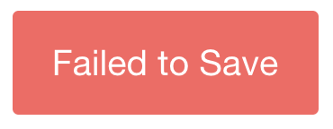

# Wisp
A Toast/Notification Library that integrates seamlessly with React and Redux.




## What is it
It's a toast-style notification system that works well with the rest of your react-redux app.
You display notifications by dispatching actions.

## Setup
Wisp requires the following dependencies to be installed:

- `react`
- `react-redux`
- `react-addons-css-transition-group`

Add the `Wisps` component to your app so it's rendered on every page (the actual location in the page doesn't matter).

```javascript
import { Wisps } from 'wisp-react-redux'
const App = () => {
    return (
        <div>
            <Wisps />

            ...Rest of the app
        </div>
    )
}
```

Add the `wispReducer` to your app's root reducer under the `wisps` key.

```javascript
import { wispReducer } from 'wisp-react-redux'
import { combineReducers } from 'redux'
export default combineReducers({
    wisps: wispReducer,
    /*...other reducers */
})
```

Also ensure that the

Now you can trigger notifications by dispatching actions! There are some action creators built in:

- successWisp
- errorWisp
- wisp

These take an options object as their only parameter:

```javascript
{
    [optional] title,
    [optional] message,
    [optional] customClass,
}
```

For example:

```javascript
successWisp({title: "Success!", message: "Document Saved"})
```

## Customization
You can customize the styling of your notifications by passing specific configuration props.

- `customClass`: 
